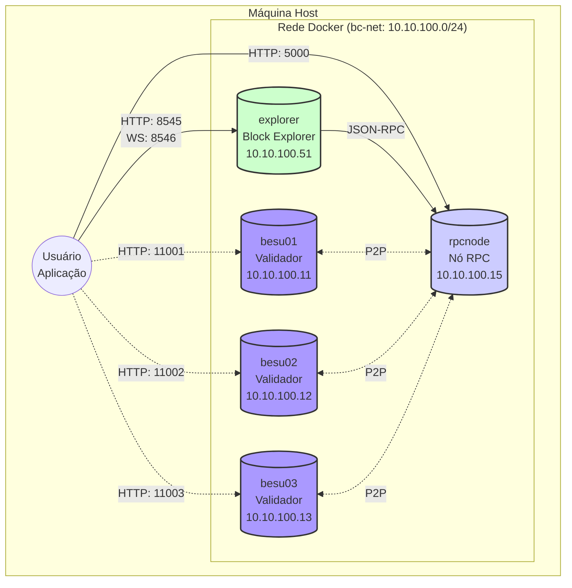

# Ambiente de Desenvolvimento/Estudo Blockchain

Este repositório contém a configuração para implantar uma rede de blockchain baseada em Hyperledger Besu usando Docker Compose. A arquitetura foi projetada para ser modular, resiliente e fácil de gerenciar.

## Índice

- [Arquitetura](#arquitetura)
- [Versões de Software](#versões-de-software)
- [Como Usar](#como-usar)
  - [Pré-requisitos](#pré-requisitos)
  - [Estrutura de Diretórios](#estrutura-de-diretórios)
  - [Configuração](#configuração)
  - [Iniciar a Rede](#iniciar-a-rede)
  - [Parar a Rede](#parar-a-rede)
  - [Limpar o Ambiente](#limpar-o-ambiente)
- [Acessando os Serviços](#acessando-os-serviços)

---

## Arquitetura

A rede blockchain é composta por 4 nós Besu e um explorador de blocos, todos operando dentro de uma rede Docker (`10.10.100.0/24`).

- **3 Nós Validadores (`besu01`, `besu02`, `besu03`):** São os nós responsáveis por validar transações e criar novos blocos. Eles se comunicam entre si através do protocolo de descoberta P2P para manter o consenso.
- **1 Nó RPC (`rpcnode`):** Este nó é um "full node" que não participa da validação, mas sincroniza com a rede. Sua principal função é servir como um ponto de entrada (endpoint) seguro e dedicado para aplicações interagirem com a blockchain via APIs JSON-RPC (HTTP e WebSocket), sem sobrecarregar os validadores.
- **1 Explorador de Blocos (`explorer`):** Uma aplicação web leve que se conecta ao `rpcnode` para exibir informações da blockchain, como blocos, transações e estados de contrato, de forma amigável.

O diagrama abaixo ilustra a topologia da rede:



### Versões de Software

- **Hyperledger Besu:** `hyperledger/besu:${BESU_VERSION}` (a versão é definida no arquivo `.env`)


## Como Usar

### Pré-requisitos

- [Docker](https://docs.docker.com/get-docker/) instalado e em execução.
- [Docker Compose](https://docs.docker.com/compose/install/) instalado.

### Estrutura de Diretórios

- `config/besu/`: Contém os arquivos de configuração do Besu, como `config.toml` e o `genesis.json`.
- `nodes/<nome-do-no>/`: Cada nó possui seu próprio diretório para armazenar dados persistentes.
  - `keys/`: Chaves criptográficas do nó.
  - `data/`: Dados da blockchain (chain data).
  - `logs/`: Logs do container.
- `docker-compose.yml`: Orquestra a inicialização e conexão de todos os serviços.
- `besu.yaml`: Arquivo base com a definição padrão dos serviços Besu, usado para evitar repetição no `docker-compose.yml`.
- `.env`: Arquivo para definir variáveis de ambiente, como a versão do Besu (`BESU_VERSION`).

### Configuração

A configuração é centralizada em 3 arquivos principais:

1.  **.env**: Defina as variáveis de ambiente globais aqui. Crie este arquivo a partir do `.env.example` se ele não existir.
    ```sh
    # Exemplo de .env
    BESU_VERSION=23.10.3
    CONSENSUS_ALGO=QBFT
    BESU_MIN_GAS_PRICE=0
    ```
2.  **besu.yaml**: Contém o serviço `x-besu-def`, que é um modelo base para todos os nós. Ele define a imagem Docker, configurações de RPC/WS, volumes e entrypoint padrão. Isso torna o `docker-compose.yml` mais limpo e fácil de ler.
3.  **docker-compose.yml**: Orquestra os containers. Ele utiliza a diretiva `extends` para herdar a configuração do `besu.yaml` e apenas sobrescreve/adiciona o que é específico de cada nó, como endereço IP, mapeamento de portas e dependências.


### Iniciar a Rede

Para iniciar todos os serviços definidos no perfil `blockchain`:

```bash
docker compose --profile blockchain up -d
```

### Parar a Rede

Para parar todos os containers da rede sem remover os dados:

```bash
docker compose --profile blockchain down
```

### Limpar o Ambiente

**Atenção:** Este comando irá parar os containers e **remover todos os volumes** associados (dados da blockchain, chaves, etc.), retornando o ambiente ao estado inicial.

```bash
docker compose --profile blockchain down -v
```

Para uma limpeza mais completa, removendo também redes e imagens não utilizadas:
```bash
docker system prune -a --volumes
```

## Acessando os Serviços

-   **Endpoint RPC Principal (HTTP):** `http://localhost:8545`
-   **Endpoint RPC Principal (WebSocket):** `ws://localhost:8546`
-   **Block Explorer:** `http://localhost:5000`

-   **Endpoints RPC dos Validadores (para debug):**
    -   `besu01`: `http://localhost:11001`
    -   `besu02`: `http://localhost:11002`
    -   `besu03`: `http://localhost:11003`

### Tutorial de configuração MetaMask & Remix

Consulte o [link](./docs/README.md)!

### Carteiras


| Endereço                                     | Chave privada                                                        |
| -------------------------------------------- | -------------------------------------------------------------------- |
| `0xfe3b557e8fb62b89f4916b721be55ceb828dbd73` | `0x8f2a55949038a9610f50fb23b5883af3b4ecb3c3bb792cbcefbd1542c692be63` |
| `0x627306090abaB3A6e1400e9345bC60c78a8BEf57` | `0xc87509a1c067bbde78beb793e6fa76530b6382a4c0241e5e4a9ec0a0f44dc0d3` |
| `0xf17f52151EbEF6C7334FAD080c5704D77216b732` | `0xae6ae8e5ccbfb04590405997ee2d52d2b330726137b875053c36d94e974d162f` |


### Exemplo de Teste

Você pode testar se o endpoint RPC está funcionando com o seguinte comando `curl`:

```bash
curl -X POST -H "Content-Type: application/json" --data '{"jsonrpc":"2.0","method":"eth_chainId","params":[],"id":1}' http://localhost:8545
```

Se a rede estiver funcionando, você receberá uma resposta JSON com o `chainId` da sua rede.