# Configurando a Metamask para uma Rede Local

## Configurando a Metamask para uma Rede Local

Guia de configuração de carteiras Metamask para se conectar a uma rede blockchain de desenvolvimento e importar uma conta existente.

### Parte 1: Adicionando a Rede Local

Primeiro, vamos adicionar as configurações da sua blockchain local à Metamask.

#### Passo 1: Abra o Seletor de Redes

Com a Metamask desbloqueada, clique no botão de seleção de rede no canto superior esquerdo da interface, como indicado pela seta vermelha.

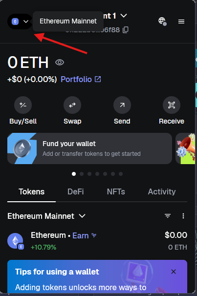

#### Passo 2: Adicione uma Nova Rede

Role a lista de redes até o final e clique no botão **"Add a custom network"**.

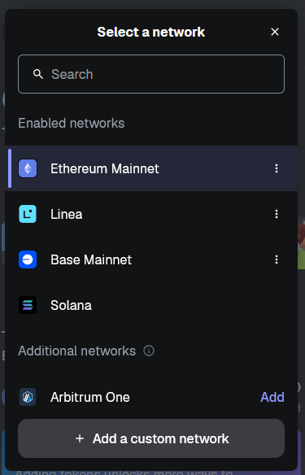

#### Passo 3: Preencha os Detalhes da Rede

Preencha o formulário com as informações da sua rede local. Utilize os seguintes dados como referência, ajustando-os conforme a configuração do seu nó RPC:

-   **Network Name:** `ufcgnet` (ou um nome de sua preferência)
-   **Default RPC URL:** `http://127.0.0.1:8545` (este é o endpoint padrão do nó RPC)
-   **Chain ID:** `1337` (este é o ID de rede comum para desenvolvimento local)
-   **Currency symbol:** `cgcoin` (o símbolo da moeda da sua rede)

Opcional

-   **Block explorer URL:** `http://127.0.0.1:5000`

Após preencher, clique em **"Save"**.

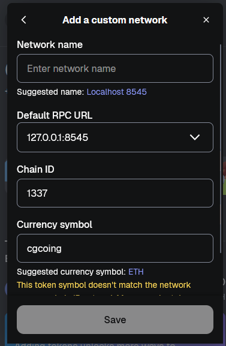

#### Passo 4: Verifique a Nova Rede

Sua rede recém-configurada (`ufcgnet`) agora deve aparecer na lista de redes disponíveis. Clique nela para selecioná-la.

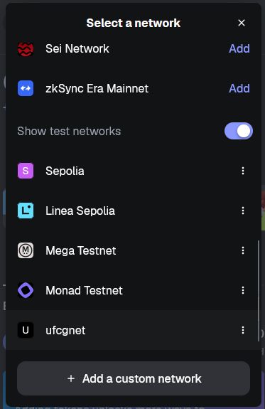

### Parte 2: Importando uma Conta

Agora que a rede está configurada, vamos importar uma conta que já possui fundos (geralmente definida no arquivo `genesis.json` da sua rede e listado no [README.md](../README.md)).

Você tambem pode cirar novas contas e transferir seus cgcoins.

#### Passo 1: Abra o Seletor de Contas

Clique no seletor de contas, localizado ao lado do seletor de redes, como indicado pela seta.

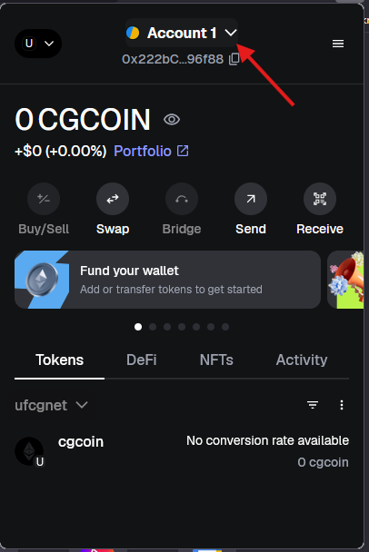

#### Passo 2: Selecione "Import Account"

Na tela seguinte, na seção "Import a wallet or account", escolha a opção **"Private Key"**.

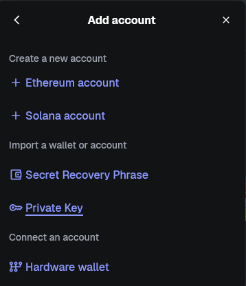

#### Passo 3: Insira a Chave Privada

Cole a chave privada da conta que você deseja importar no campo indicado e clique no botão para confirmar a importação.

*(Nota: A chave privada é uma informação sensível. Manuseie-a com cuidado e nunca a compartilhe.)*

#### Passo 4: Conta Importada com Sucesso

Se a chave privada for válida, a conta será adicionada à sua Metamask. Se a conta tiver um saldo pré-definido na sua rede, ele será exibido como na imagem abaixo, mostrando o saldo de 200 CGCOIN.

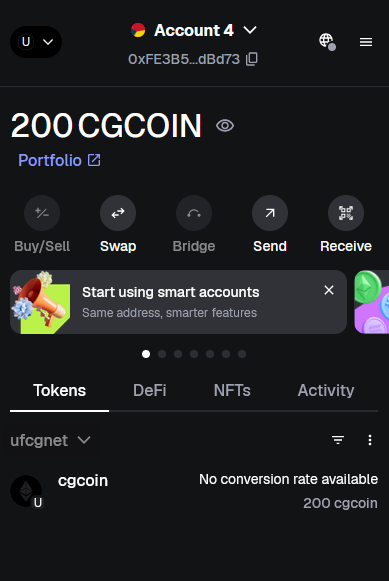

Pronto! Sua Metamask está configurada para interagir com sua rede blockchain local.

## Configurando o Remix IDE

Com a Metamask pronta, o próximo passo é conectar o Remix IDE à sua rede local. Isso permitirá que você compile e implante seus contratos diretamente na sua blockchain.

### Passo 1: Configurando o driver

Vamos utilizar um provedor injetado!

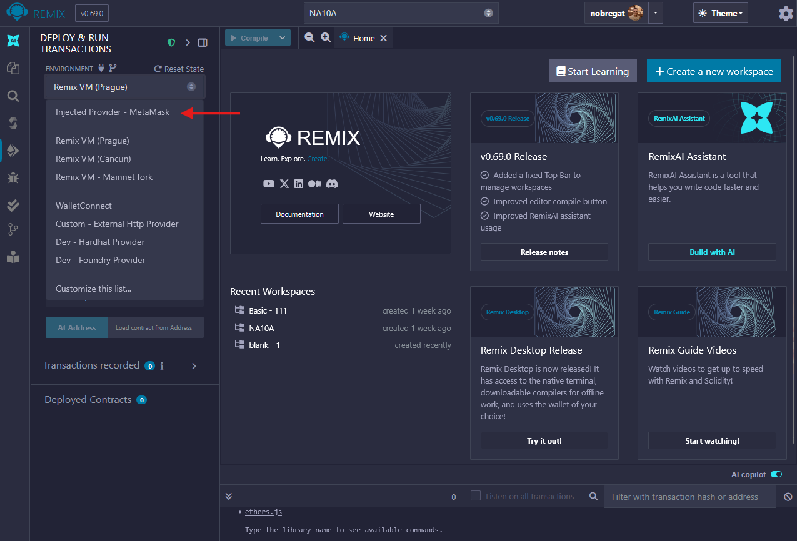

Apos configurar o metamask deve pedir a sua permissão!

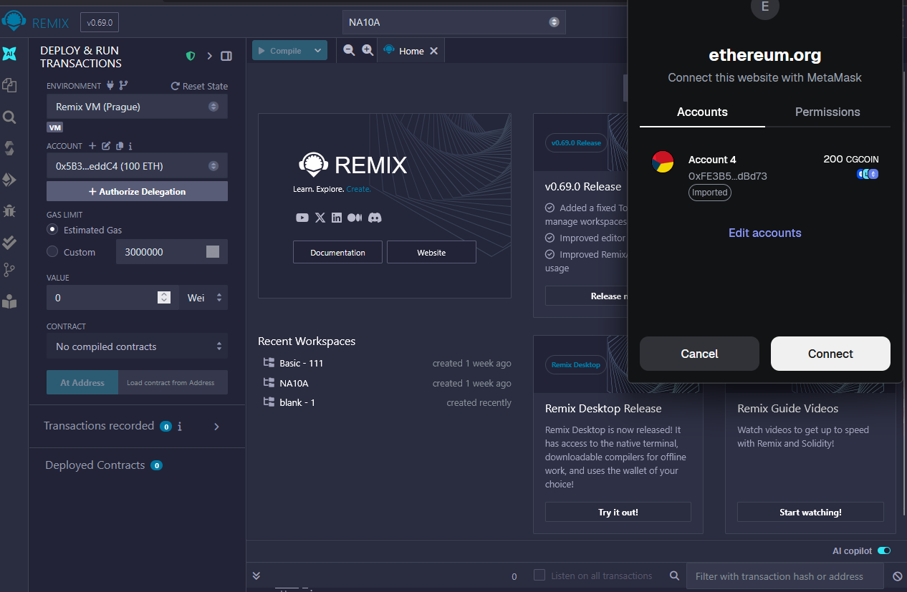

### Passo 2: Compile o Smart Contract

Antes de implantar, você precisa compilar seu contrato. Certifique-se de que o compilador no Remix está configurado corretamente para a sua rede.

-   Navegue até a aba **"Solidity Compiler"** (indicada pela seta verde).
-   Selecione a **versão do compilador** (seta amarela) que seja compatível com o seu smart contract.
-   **Importante:** Na seção "Advanced Configurations", defina a **"EVM VERSION"** para **"berlin"** (seta vermelha), que é a versão correspondente à atualização de rede da sua blockchain Besu.

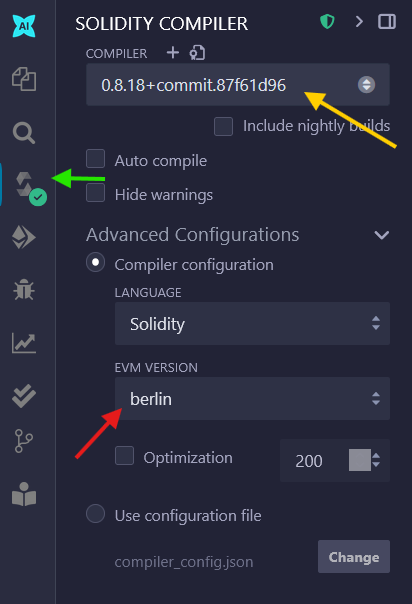

Após configurar, clique no botão **"Compile"** para compilar seu contrato.

### Passo 3: Conecte o Remix à Metamask

Agora, vamos configurar o ambiente de implantação.

-   Vá para a aba **"Deploy & Run Transactions"**.
-   No menu suspenso **"ENVIRONMENT"**, altere a opção de "Remix VM (Prague)" para **"Injected Provider - MetaMask"** (indicado pela seta vermelha).

Imediatamente após selecionar a opção, uma janela da Metamask irá aparecer, solicitando permissão para que o Remix se conecte à sua carteira.

-   Certifique-se de que a conta correta (a que importamos anteriormente, `Account 4`) esteja selecionada.
-   Clique em **"Connect"** para autorizar a conexão.

### Exportanto a ABI

Para exportar ABI para uso externo

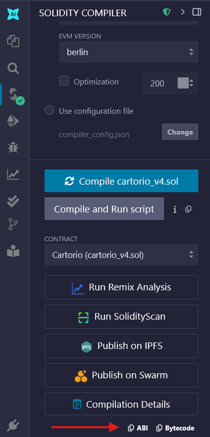

Com isso, o Remix está pronto para implantar e interagir com os smart contracts na sua blockchain local